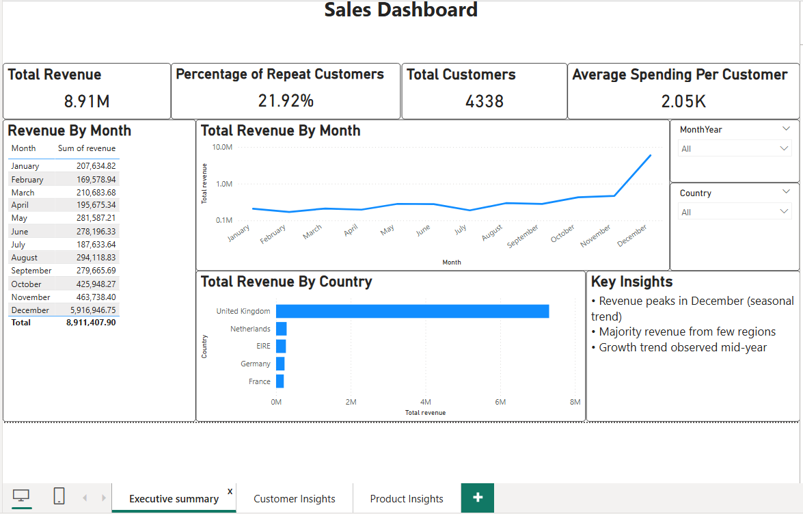
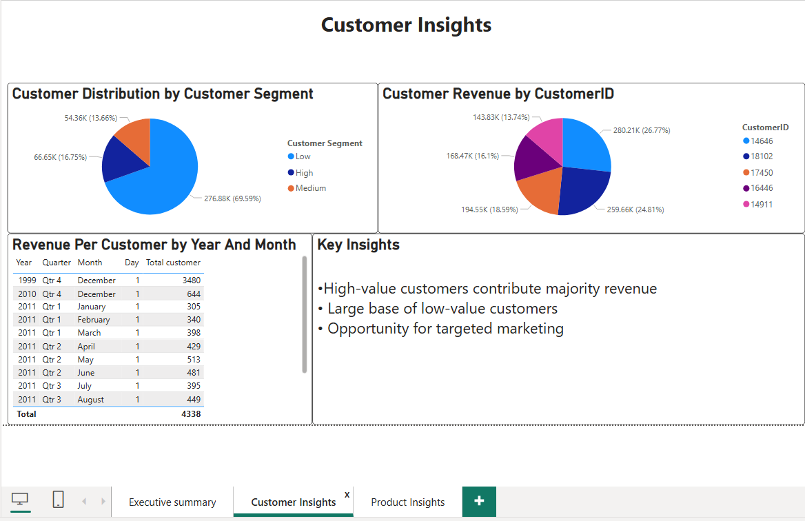
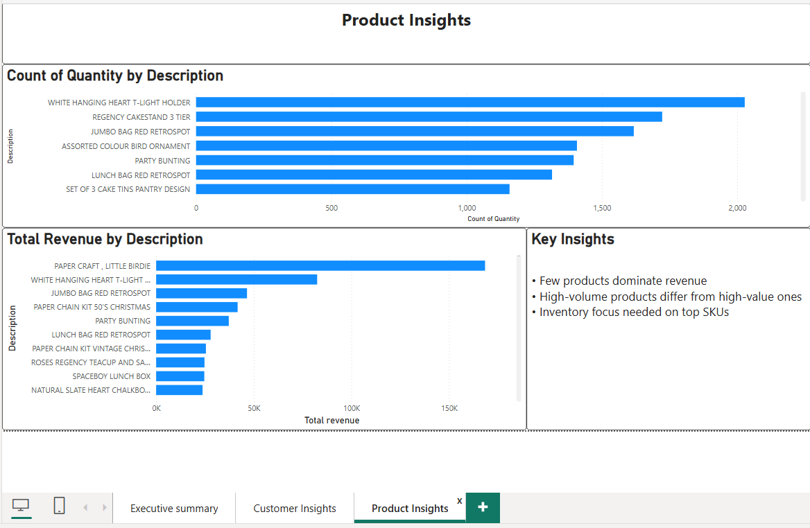

# Online_retail_sales_analysis
Retail Sales Analytics Dashboard using SQL and Power BI

## Overview
This project presents an end-to-end data analysis workflow, starting from raw transactional data to an interactive Power BI dashboard. The goal is to derive meaningful business insights related to revenue trends, customer behavior, and product performance.

---

##  Tech Stack
- SQL (Data Cleaning & Analysis)
- Power BI (Dashboard & Visualization)
- CSV (Data Source)

---

## Dashboard Features

###  Executive Overview
- Total Revenue: 8.9M
- Total Customers: 4.3K
- Average Spending per Customer
- Monthly revenue trend analysis

---

###  Customer Insights
- Customer segmentation (High, Medium, Low value)
- Identification of top customers
- Distribution of customer spending behavior

---

###  Product Insights
- Top products by revenue
- Top products by quantity sold
- SKU-level performance analysis

---

##  Key Insights
- Revenue peaks significantly in December due to seasonal demand
- A small percentage of customers contribute to the majority of revenue
- High-volume products differ from high-revenue products
- Opportunity for targeted marketing and inventory optimization

---

##  Dashboard Preview

### Executive Dashboard

### Customer Insights

### Product Insights

---

##  Future Improvements
- Add customer retention and churn analysis
- Include profit and margin analysis
- Implement forecasting models

---

##  Author
**Keaton Fernandes**  
GitHub: https://github.com/Keaton-Francis-Fernandes
